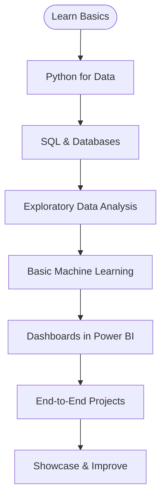

<!-- 🚀 Modern Animated Header | Data Science Learner -->

<p align="center">
  
</p>

<p align="center">
  
</p>

<h1 align="center">Hi, I'm Riddhima Agrawal! 👋</h1>

<p align="center" style="font-size:1.05em">
  <strong>🚀 Data Science</strong> &nbsp;|&nbsp; <strong>📈 Aspiring Data Analyst</strong> &nbsp;|&nbsp; <strong>🧠 Python & Power BI</strong>
</p>

<p align="center">
  <a href="#about">About</a> •
  <a href="#skills">Skills</a> •
  <a href="#roadmap">Roadmap</a> •
  <a href="#projects">Projects</a> •
  <a href="#connect">Connect</a>
</p>

---

## 🧬 About Me
A curious and results-driven learner who loves turning messy data into clear insights. I build end-to-end analysis and dashboards using Python, SQL, and Power BI — continuously experimenting with models and visual storytelling.

---

## 💡 Tech & Tools

<div align="center">
  <!-- Core -->
  <a href="https://www.python.org/" target="_blank"></a>
  <a href="https://www.sql.org/" target="_blank"></a>
  <a href="https://powerbi.microsoft.com/" target="_blank"></a>
  <a href="https://pandas.pydata.org/" target="_blank"></a>
  <a href="https://numpy.org/" target="_blank"></a>
  <a href="https://scikit-learn.org/" target="_blank"></a>
  <a href="https://www.tensorflow.org/" target="_blank"></a>
</div>

<br>

### Skills (at-a-glance)
- Python: ██████████ 90%
- SQL: █████████▌ 85%
- Data Visualization (Power BI / Matplotlib / Seaborn): ████████▌ 80%
- EDA & Feature Engineering: █████████ 88%
- Machine Learning (basic models & evaluation): ████████ 78%

---

## 🛣️ Roadmap


---

## ⭐ Featured Projects
> Click project titles to view details (add repo links here)

- [End-to-End Sales Analysis Dashboard](#) — Cleaned transactional data, modeled KPIs, and built interactive Power BI dashboard.
- [Customer Segmentation (Clustering)](#) — Performed feature engineering and KMeans to discover customer segments and delivered actionable insights.
- [Time Series Forecasting](#) — Forecasted monthly demand with accuracy improvements via feature engineering.

(If you want, I can add cards for each project with screenshots and direct repo links.)

---

## 📊 GitHub Stats

<div align="center">
  
  
</div>

---

## 📡 Connect With Me

<div align="center">
  <a href="https://www.linkedin.com/in/riddhima-agrawal708/" target="_blank"></a>
  <a href="mailto:riddhimaagrawal708@gmail.com"></a>
  <a href="https://twitter.com/" target="_blank"></a>
</div>

---

## 🎯 Final Thought

> Pipelines are like puzzles; ML is like magic.  
> Every new tool is a party, and every new problem is an invitation.  
> Making tech more fun, fast, and fail-proof—one commit at a time.

<div align="center">
  
  <br>
  <sub><i>Modern Analyst + DataScience by Riddhima Agrawal</i></sub>
</div>
```
